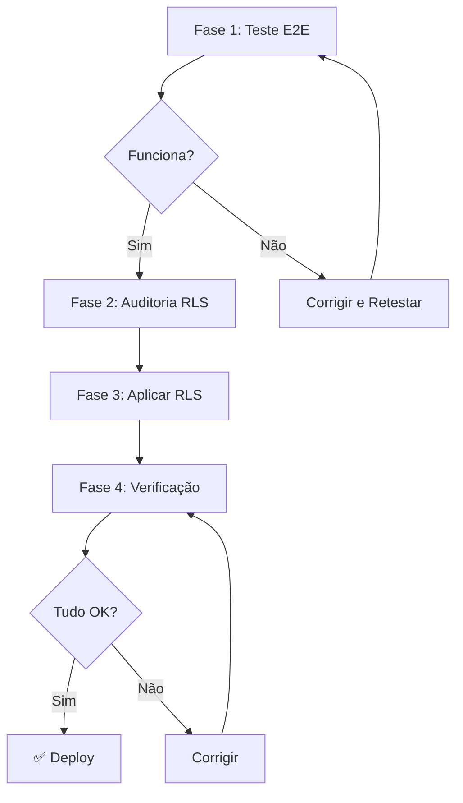

# Plano: Teste E2E + Segurança RLS Antes do Deploy

## Objetivo
Garantir que o Bot Fazendeiro está seguro e funcional antes do deploy em produção.

> **Nota**: Deploy será feito manualmente pelo usuário via **Coolify**.

---

## Fase 1: Teste E2E de Pagamento

### 1.1 Preparar Ambiente de Teste
- [ ] Verificar que Edge Function `create-pix-charge` está ativa
- [ ] Verificar que Edge Function `webhook-pix` está ativa
- [ ] Verificar conexão Asaas → Supabase

### 1.2 Criar Cobrança PIX de Teste
- [ ] Chamar `create-pix-charge` com dados de teste
- [ ] Verificar que cobrança foi criada no Asaas
- [ ] Verificar registro em `pagamentos_pix`

### 1.3 Simular Pagamento
- [ ] Usar `simulate-payment` para simular confirmação
- [ ] Verificar que webhook recebeu notificação
- [ ] Verificar atualização em `assinaturas`

### 1.4 Validar Fluxo Completo
- [ ] Assinatura marcada como ativa
- [ ] Data de vencimento atualizada
- [ ] Logs sem erros

---

## Fase 2: Auditoria de Segurança RLS

### 2.1 Mapear Tabelas Críticas
| Tabela | Criticidade | RLS Atual |
|--------|-------------|-----------|
| `assinaturas` | 🔴 Alta | Permissivo |
| `pagamentos_pix` | 🔴 Alta | Permissivo |
| `usuarios_frontend` | 🔴 Alta | Permissivo |
| `empresas` | 🟡 Média | Permissivo |
| `funcionarios` | 🟡 Média | Permissivo |

### 2.2 Definir Políticas de Acesso
- [ ] `assinaturas`: Apenas servidores próprios podem ler
- [ ] `pagamentos_pix`: Apenas admins do servidor
- [ ] `usuarios_frontend`: Usuário pode ver próprio registro
- [ ] `empresas`: Membros do servidor podem ver

### 2.3 Criar Migrations RLS
- [ ] Migration para `assinaturas`
- [ ] Migration para `pagamentos_pix`
- [ ] Migration para `usuarios_frontend`

---

## Fase 3: Aplicar Correções

### 3.1 Executar Migrations
- [ ] Aplicar políticas RLS via Supabase MCP
- [ ] Verificar que políticas estão ativas

### 3.2 Retestar Funcionalidades
- [ ] Testar login frontend
- [ ] Testar comandos do bot Discord
- [ ] Testar fluxo de pagamento novamente

---

## Fase 4: Verificação Final

### 4.1 Checklist de Segurança
- [ ] RLS habilitado em tabelas críticas
- [ ] Políticas restritivas (não mais `true`)
- [ ] Service Role Key apenas no backend
- [ ] Anon Key não expõe dados sensíveis

### 4.2 Checklist de Funcionalidade
- [ ] Discord bot responde comandos
- [ ] Frontend carrega corretamente
- [ ] Pagamento PIX funciona
- [ ] Webhook atualiza assinatura

---

## Ordem de Execução

---

## Tempo Estimado

| Fase | Tempo |
|------|-------|
| Fase 1: Teste E2E | 30 min |
| Fase 2: Auditoria RLS | 45 min |
| Fase 3: Aplicar Correções | 30 min |
| Fase 4: Verificação | 30 min |
| **Total** | **~2h15min** |
